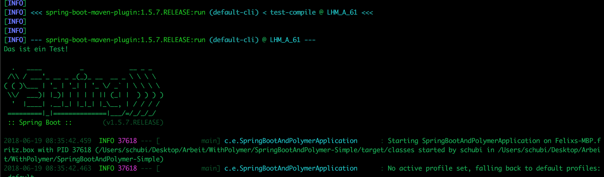

# SpringBoot

- Maven muss nich nach jeder veränderung des Codes neugestartet werden!
- Die Bower Components müssen im Static Ordner untergebracht werden.
- Einfache Skriptbefehle funktionieren in der HTML Datei

- "appFelix.run(args);" ruf Spring auf
- Dokumentation: https://docs.spring.io/spring-boot/docs/current/api/org/springframework/boot/SpringApplication.html
- Funktioniert nicht: http://www.baeldung.com/spring-boot-custom-error-page
- Custom Error Page mit Button zur Homepage:
    -> resources/public/error/404.html

- Controller werden mit in die "main.java" Datei geschrieben:
    -> https://spring.io/guides/gs/serving-web-content/

- thymeleaf genauer anschauen_> vorallem im Zusammenhang mit den Controllern && Polymer / Webcomponents

## Guide to installing 3rd party JARs

- https://maven.apache.org/guides/mini/guide-3rd-party-jars-local.html
